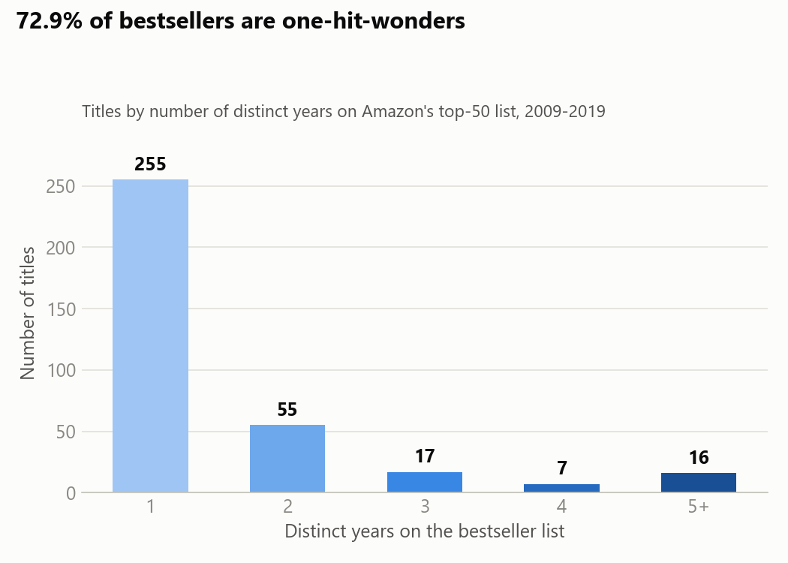
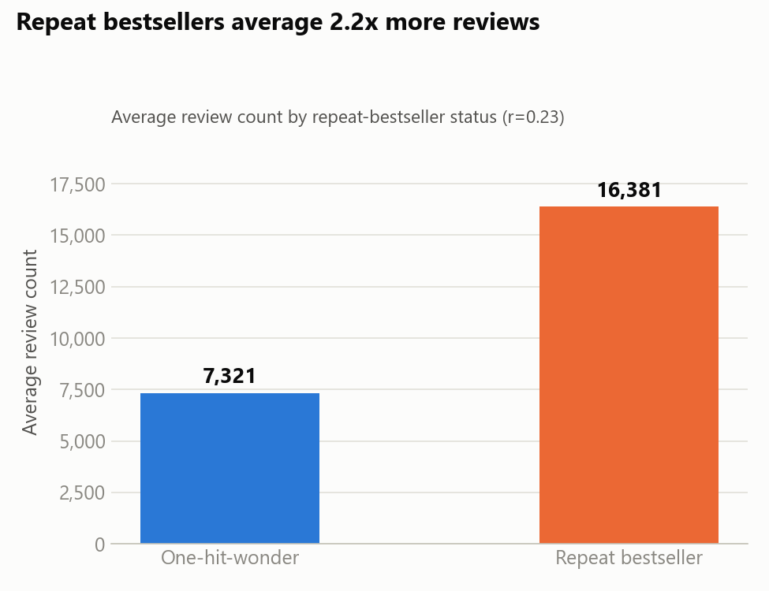
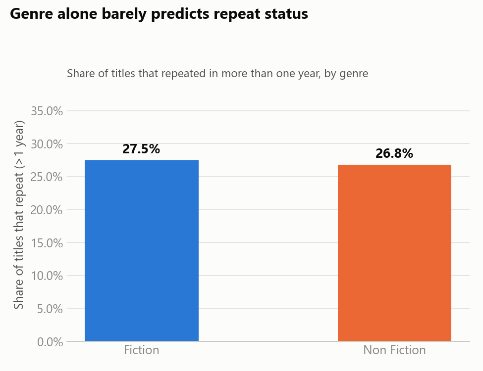
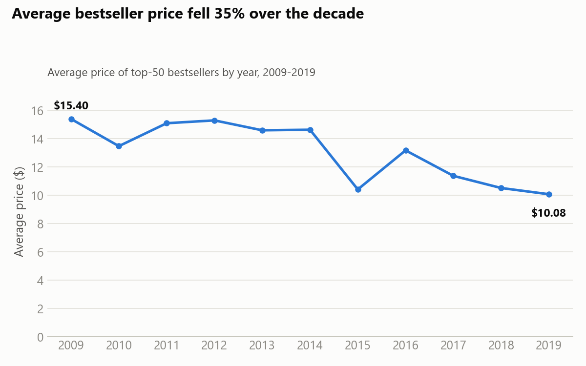
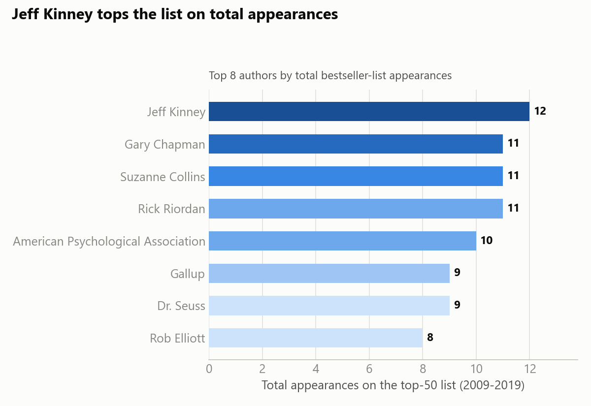

# 5. Share

Five visualizations for the publishing-client deliverable: blue = one-hit-wonder / Fiction,
orange = repeat bestseller / Non Fiction (two-category comparisons), a light-to-dark blue ramp for
ordinal rankings, direct labels, minimal clutter.

Chart-generation code: [`notebooks/03_share_visualizations.ipynb`](../notebooks/03_share_visualizations.ipynb).

## 1. Most bestsellers are one-hit-wonders

255 of 350 titles (72.9%) appear on the top-50 list in exactly one year. Only 16 titles have
appeared in 5 or more distinct years — repeat bestsellers are the exception, not the rule.

## 2. Reviews — the clearest repeat-bestseller signal

Repeat bestsellers average 16,381 reviews vs. 7,321 for one-hit-wonders — more than double, and
the strongest correlation found with `times_on_list` (r=0.23) of any variable tested. Reviews are
essentially uncorrelated with price or rating, so this is an independent signal.

## 3. Genre barely matters

Fiction repeats 27.5% of the time, Non Fiction 26.8% — a 1-point gap. Genre alone does not
meaningfully predict whether a title will stay on the list across years.

## 4. A steady price decline across the decade

Average bestseller price fell from $15.40 (2009) to $10.08 (2019) — a 35% decline, consistent
with the well-documented shift toward lower-priced Kindle ebook editions over this period. Any
pricing guidance drawn from this dataset should account for that trend, not treat the 2009-2019
average as current.

## 5. Top authors by total appearances

Jeff Kinney leads with 12 appearances — but across 12 *distinct* titles (the *Diary of a Wimpy
Kid* franchise), not one repeating book. Gary Chapman, Suzanne Collins, and Rick Riordan follow
closely with 11 appearances each, achieved through very different patterns (Chapman from just 2
titles; Riordan from 10).

## What the data tells

Genre, price, and rating — the variables acquisitions teams often lean on first — show almost no
relationship with repeat-bestseller status in this dataset. Review count is the clearest available
signal, though moderate, not deterministic. The list is dominated by one-hit-wonders, and the
decade shows a steady price decline alongside rising review volume — both platform-driven trends
worth factoring into any strategy built on this data.
