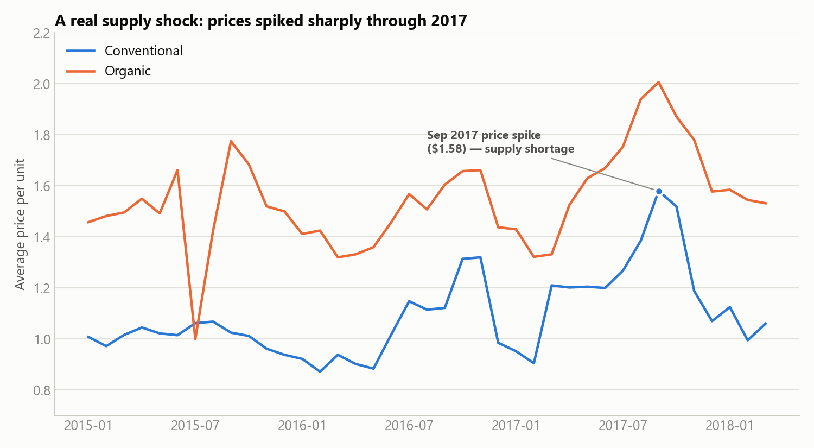

# Avocado Prices Case Study

Capstone Case Study 3 ("Follow Your Own Case Study Path") from the Google Data Analytics
Professional Certificate. Client scenario: a grocery retail chain wants to know **how avocado
prices and volume vary by region, season, and type — to inform pricing and purchasing strategy.**

## Process

1. [Ask](./docs/01_ask.md) — business task & stakeholders ✅
2. [Prepare](./docs/02_prepare.md) — data sources, organization, credibility ✅
3. [Process](./docs/03_process.md) — cleaning & transformation ✅
4. [Analyze](./docs/04_analyze.md) — trends & calculations ✅
5. [Share](./docs/05_share.md) — visualizations & key findings ✅
6. [Act](./docs/06_act.md) — final recommendations ✅

## Top recommendation

Adopt **regional pricing** instead of a national flat rate — conventional avocado prices vary 55%
across the 8 major US regions, a consistent multi-year pattern. Full reasoning and 2 more
recommendations in [docs/06_act.md](./docs/06_act.md).

## Key finding



A real 2017 supply shock is visible directly in the price history — see
[docs/05_share.md](./docs/05_share.md) for the full set of visualizations.

## Repo structure

```
avocado-prices-case-study/
├── docs/         # write-ups for each phase (Ask, Prepare, Process, Analyze, Share, Act)
├── data/
│   ├── raw/      # original downloaded data (not committed — see data/raw/README.md)
│   ├── processed/# cleaned/merged datasets used for analysis
│   └── summary/  # small aggregate tables used to build the Share-phase charts
├── notebooks/    # Python (pandas/Jupyter) analysis
├── sql/          # SQL scripts
└── images/       # exported charts/visualizations
```

## Data source

[Avocado Prices](https://www.kaggle.com/neuromusic/avocado-prices) (Kaggle, CC0, via Justin
Kiggins / the Hass Avocado Board).
