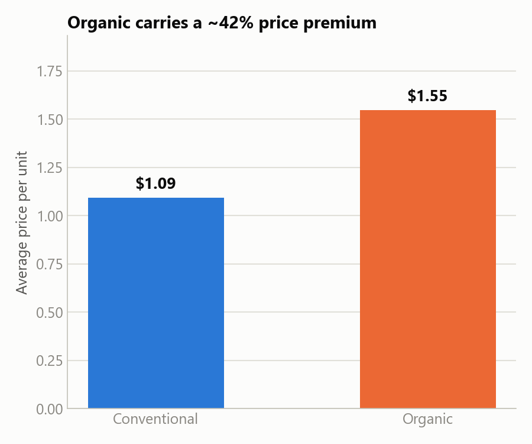
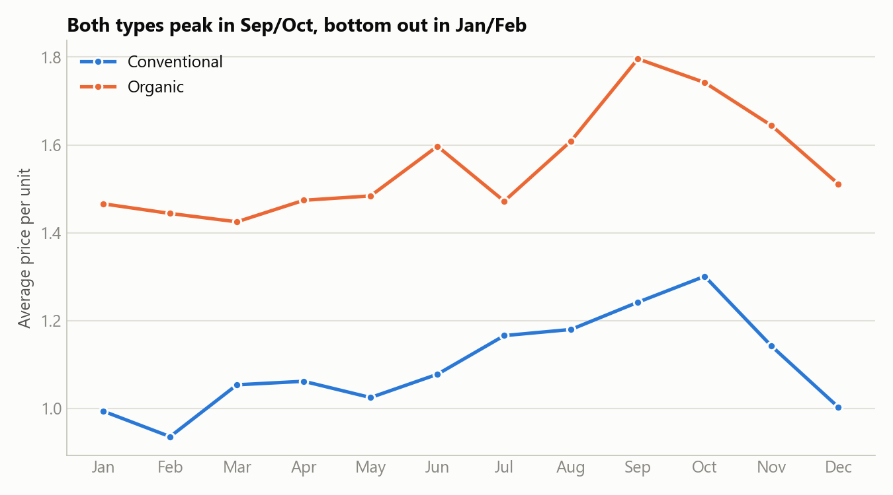
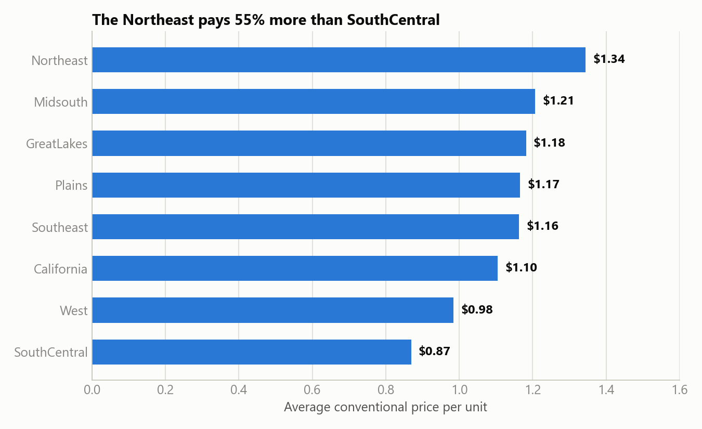
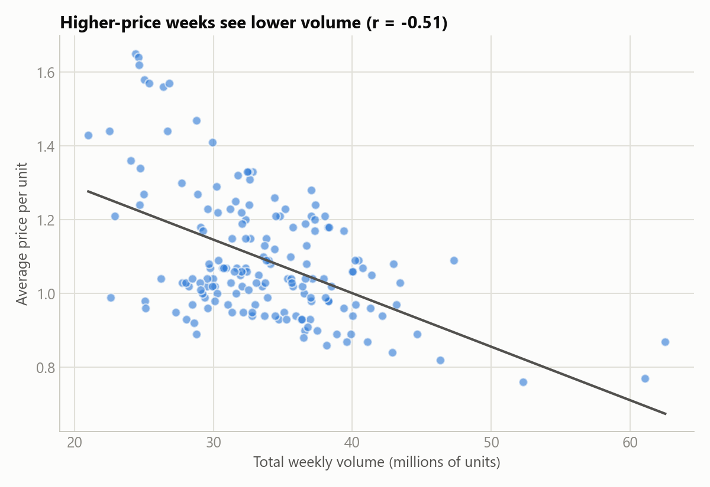

# 5. Share

Five visualizations for the retail-client deliverable: blue = conventional, orange = organic
throughout, direct labels, minimal clutter.

Chart-generation code: [`notebooks/03_share_visualizations.ipynb`](../notebooks/03_share_visualizations.ipynb).

## 1. The organic premium

Organic averages $1.55/unit vs. $1.09 for conventional — a ~42% premium, consistent across the
whole dataset.

## 2. A predictable seasonal pattern

Both types peak in September/October and bottom out in January/February, every year — a reliable
planning signal for inventory and pricing calendars.

## 3. A real supply shock, visible in the price history

Prices climbed sharply through 2017, peaking well above the normal range — matching the
well-documented 2017 avocado supply shortage. (The flat dip to exactly $1.00 for organic in
mid-2015 is a data-quality artifact, not a real price event — see `docs/04_analyze.md`.)

## 4. Regional prices vary by more than half

The Northeast pays 55% more than SouthCentral for the same conventional avocados — a national
flat price leaves real margin on the table.

## 5. Price and demand move together

A clear negative relationship (r=-0.51): weeks with higher prices see meaningfully lower volume —
useful for modeling how a price change might affect sell-through.

## What the data tells

Avocado demand is seasonal, regionally uneven, and price-sensitive — three levers a retail
pricing/purchasing strategy can act on directly, plus a real historical supply-shock event worth
planning contingencies around.
