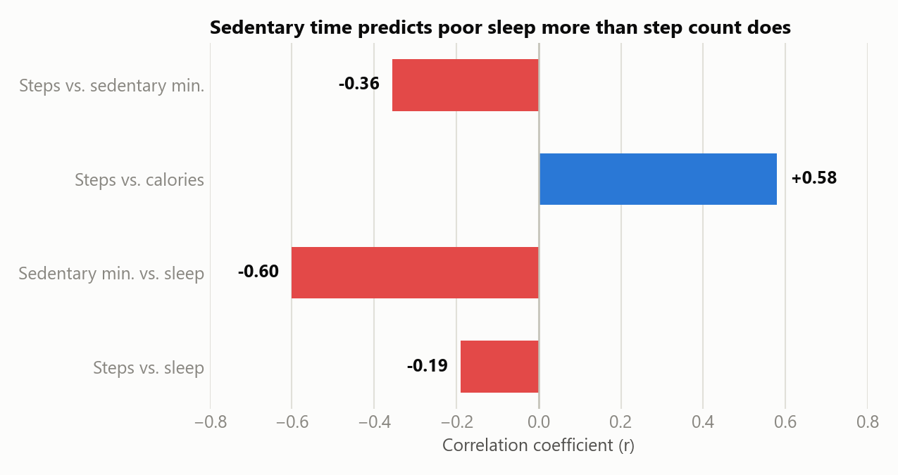

# Bellabeat Wellness Technology Case Study

Capstone case study from the Google Data Analytics Professional Certificate. Bellabeat is a
high-tech wellness company for women; this project analyzes public FitBit smart-device usage data
to answer: **what trends in smart device usage could inform Bellabeat's marketing strategy?**

## Process

This project follows the six-phase data analysis process:

1. [Ask](./docs/01_ask.md) — business task & stakeholders ✅
2. [Prepare](./docs/02_prepare.md) — data sources, organization, credibility ✅
3. [Process](./docs/03_process.md) — cleaning & transformation ✅
4. [Analyze](./docs/04_analyze.md) — trends & calculations ✅
5. [Share](./docs/05_share.md) — visualizations & key findings ✅
6. Act — final recommendations (🚧 next)

## Key finding



Sedentary time correlates with poor sleep (r=-0.60) far more strongly than step count does
(r=-0.19) — see [docs/05_share.md](./docs/05_share.md) for the full set of visualizations.

## Repo structure

```
bellabeat-wellness-case-study/
├── docs/         # write-ups for each phase (Ask, Prepare, Process, Analyze, Share, Act)
├── data/
│   ├── raw/      # original downloaded data (not committed — see data/raw/README.md)
│   ├── processed/# cleaned/merged datasets used for analysis (not committed — large)
│   └── summary/  # small aggregate tables used to build the Share-phase charts
├── notebooks/    # Python (pandas/Jupyter) analysis
├── sql/          # SQL scripts
└── images/       # exported charts/visualizations
```

## Data source

[FitBit Fitness Tracker Data](https://www.kaggle.com/datasets/arashnic/fitbit) (CC0: Public
Domain, made available on Kaggle through Mobius) — minute-level activity, heart rate, and sleep
data submitted by 30 consenting FitBit users.
