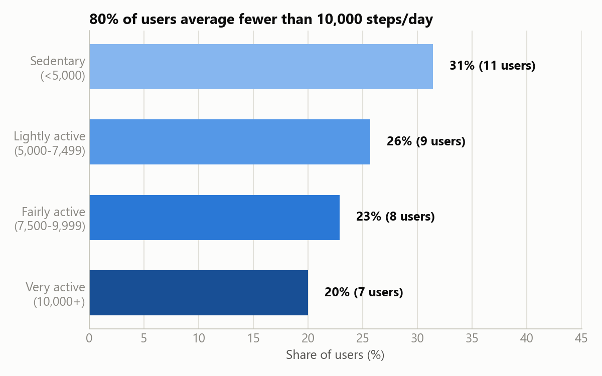
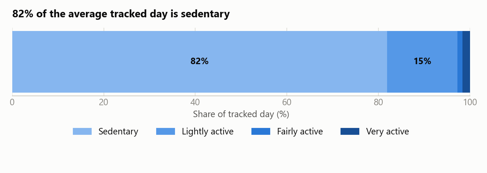
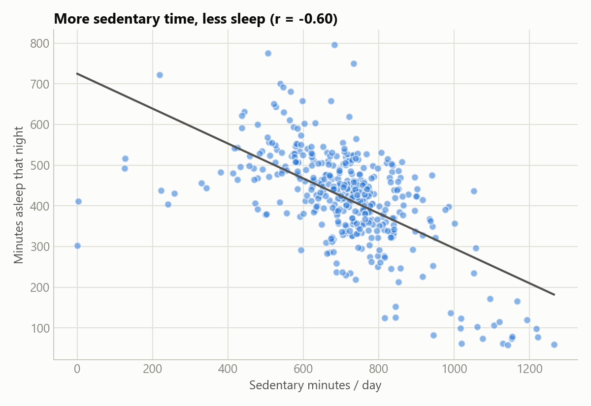
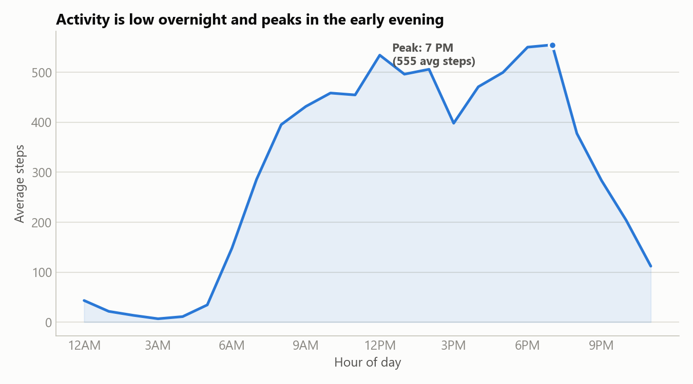

# 5. Share

Five visualizations built from the Analyze-phase summary tables, designed for a non-technical
executive audience: a single blue hue (light → dark) for the ordinal activity bands, blue/red
diverging for correlation signs, minimal chart clutter, and direct labels on the story-relevant
points.

Chart-generation code: [`notebooks/03_share_visualizations.ipynb`](../notebooks/03_share_visualizations.ipynb).

## 1. Most users fall short of 10,000 steps/day

31% of users average under 5,000 steps/day ("sedentary"), and only 20% reach the commonly-cited
10,000-step benchmark. **80% of this sample is below that benchmark.**

## 2. Where the tracked day actually goes

Of the ~20 hours/day the device tracks, **82% is sedentary**. Very-active and fairly-active
minutes combined are under 3% of tracked time.

## 3. What actually correlates with poor sleep

Steps correlate only weakly with sleep (-0.19). **Sedentary minutes correlate with sleep more
than three times as strongly (-0.60)** — the more sedentary time in a day, the less sleep that
night.

## 4. Sedentary time vs. sleep, in detail

The relationship from chart 3, shown directly: as daily sedentary minutes rise, minutes asleep
that night trend clearly downward.

## 5. When people are actually active

Activity is minimal overnight, ramps up from 6 AM, and **peaks in the early evening (7 PM)** —
a broad active window rather than a single sharp spike, with no strong morning-specific peak.

## What the data tells

Every chart points to the same reframing: **the standard "encourage more steps" narrative
undersells the real opportunity.** In this data, sedentary time — not step count — is what tracks
most closely with a meaningful wellness outcome (sleep). That's a better fit for Bellabeat's
always-worn product line (Leaf, Time) than a step-counting pitch, and directly shapes the
recommendations in the Act phase.
