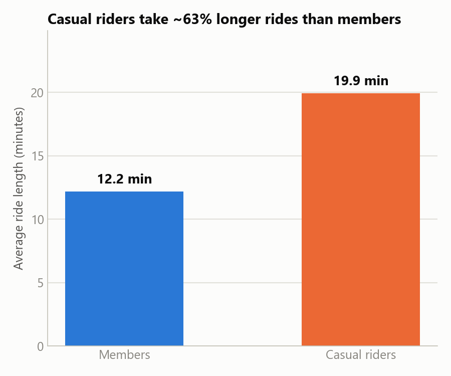
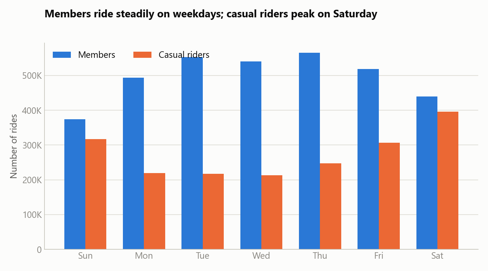
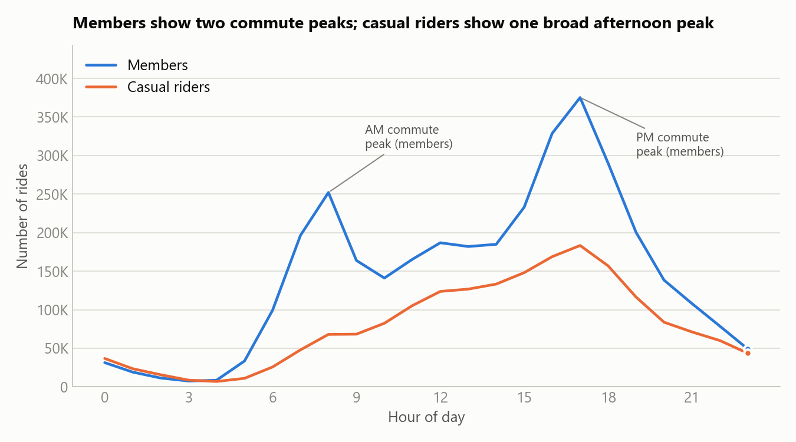
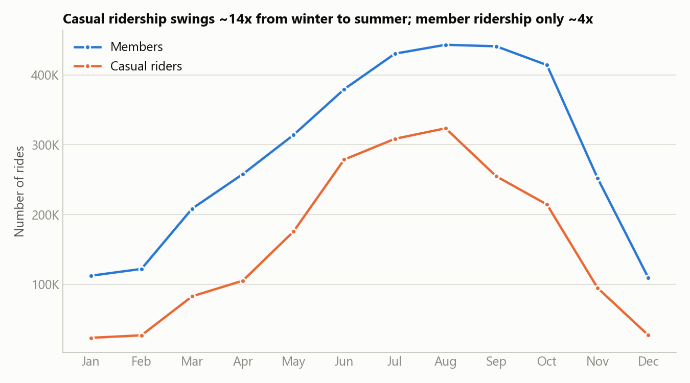
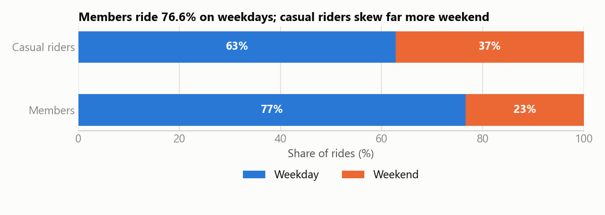

# 5. Share

Five visualizations built from the Analyze-phase summary tables, designed for a non-technical
executive audience: one clear headline per chart, a two-color palette (blue = members, orange =
casual riders) used consistently throughout, minimal chart clutter, and direct labels/annotations
on the story-relevant points rather than dense data labels everywhere.

Chart-generation code: [`notebooks/03_share_visualizations.ipynb`](../notebooks/03_share_visualizations.ipynb).

## 1. Ride length — the headline number

Casual riders average **19.9 minutes** per ride versus **12.2 minutes** for members — a ~63%
gap. This single number is the clearest evidence that the two groups use Cyclistic differently.

## 2. Weekly rhythm

Member ride volume is high and steady Monday–Friday, dipping on weekends — a commute pattern.
Casual ride volume climbs through the week and **peaks on Saturday**, both in count and (per the
Analyze phase) average duration.

## 3. Time of day — the clearest signal in the whole dataset

Members show a **textbook two-peak commute profile**: a sharp spike at 7–8 AM and an even bigger
one at 4–6 PM, with a trough in between. Casual riders show **no morning peak at all** — their
volume rises gradually and peaks in the afternoon. This is the strongest visual evidence that
members primarily commute and casual riders primarily ride for leisure.

## 4. Seasonality

Both groups ride more in summer, but casual ridership swings **~14x** between the slowest month
(January) and the busiest (August), while member ridership only swings **~4x**. Members ride
Cyclistic as reliable, year-round transportation; casual riders ride it as a seasonal, weather-
dependent activity.

## 5. Weekday vs. weekend

77% of member rides happen on a weekday versus 63% for casual riders — casual riders are
proportionally far more likely to ride on a weekend.

## What the data tells

Every chart points the same direction: **members use Cyclistic to commute, casual riders use it
for leisure.** Members ride short, frequent, weekday, rush-hour trips at a steady rate all year.
Casual riders ride longer, less frequent trips concentrated on weekend afternoons and summer
months. This answers the Ask-phase business question and is the foundation for the marketing
recommendations in the Act phase.
