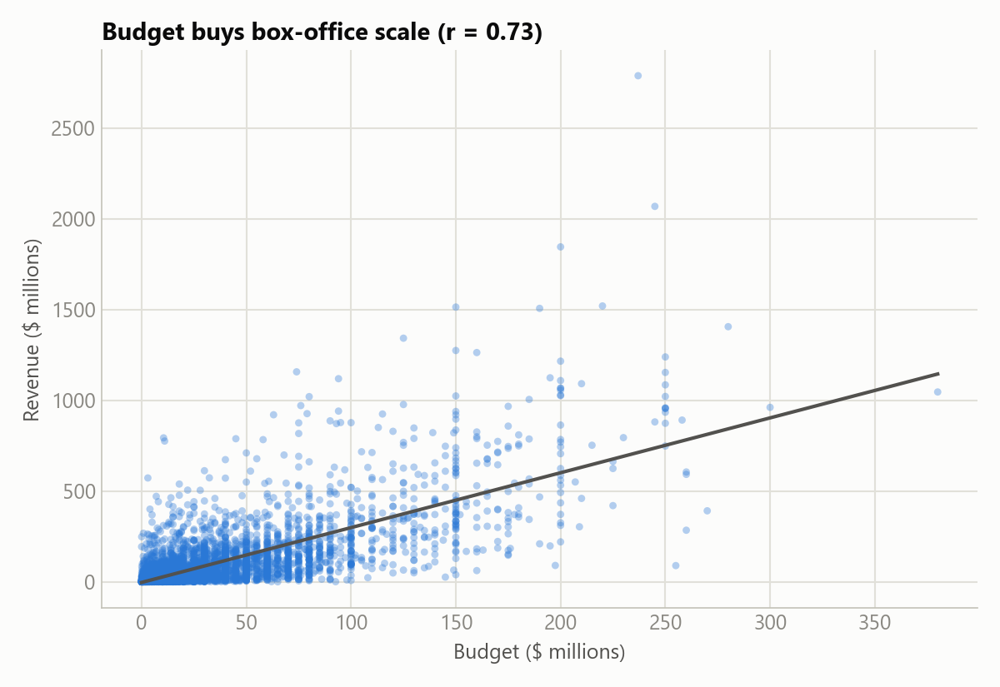
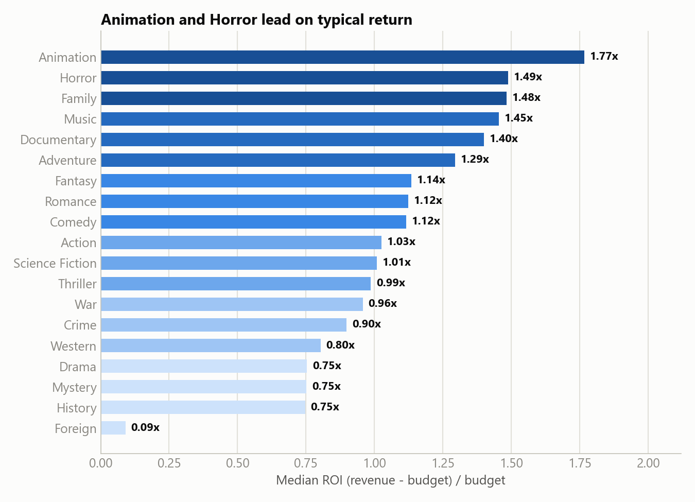
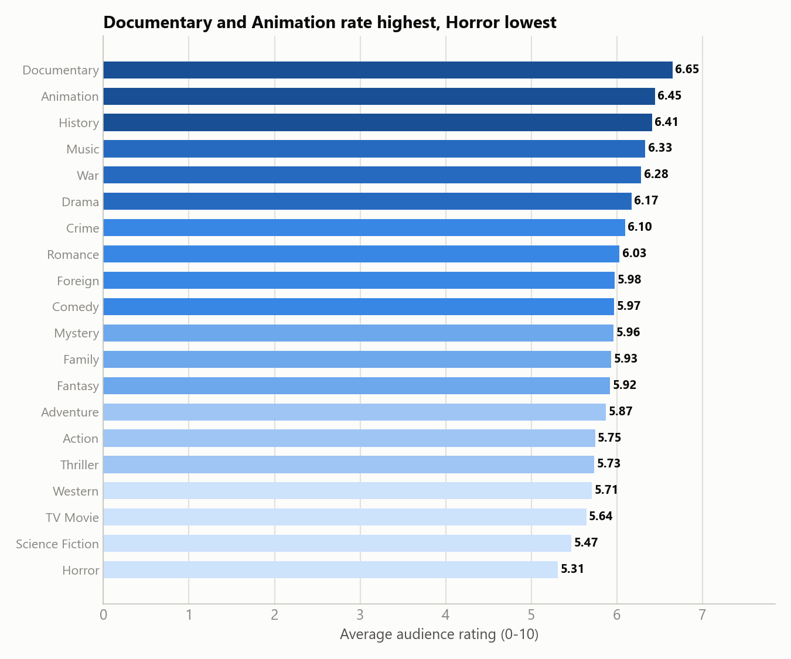
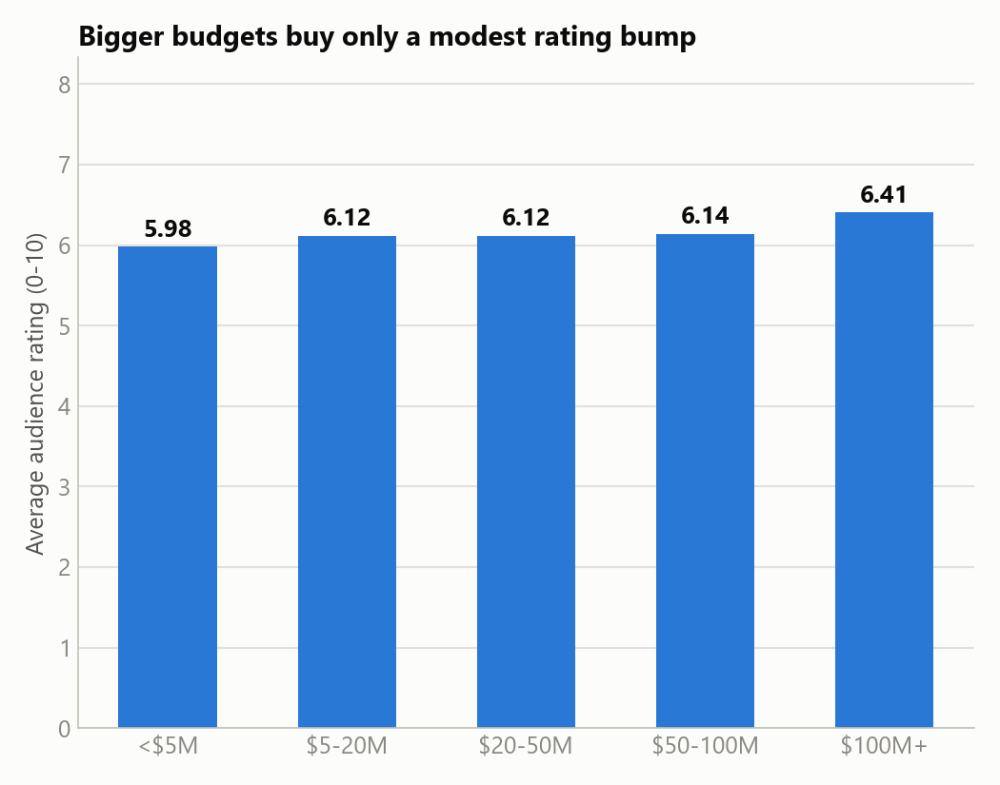
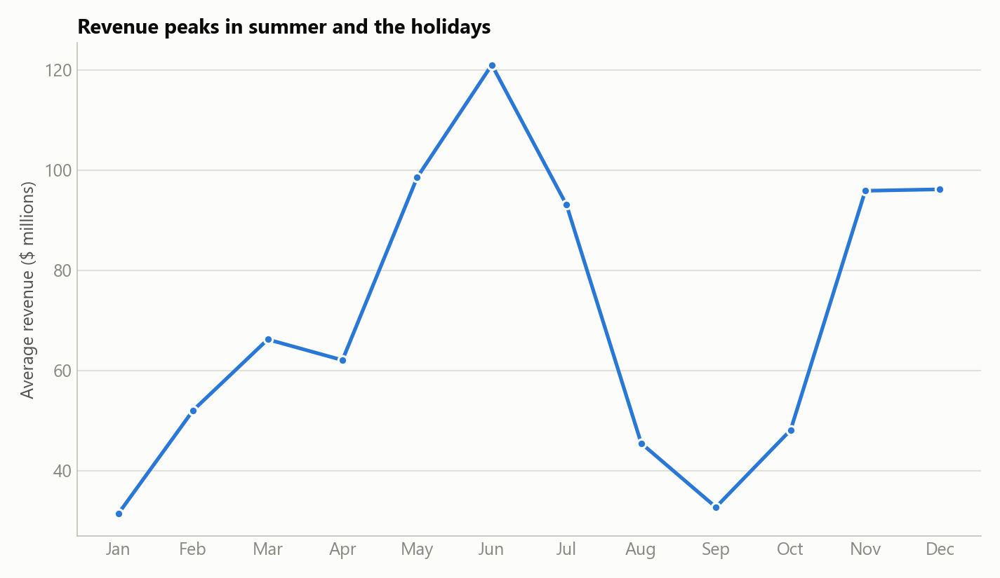

# 5. Share

Five visualizations for the studio investment-committee deliverable: blue for single-series
charts, a sequential blue ramp (light -> dark) for the two genre rankings, direct value labels,
minimal clutter.

Chart-generation code: [`notebooks/03_share_visualizations.ipynb`](../notebooks/03_share_visualizations.ipynb).

## 1. Budget buys box-office scale

A clear, strong relationship (r = 0.73): bigger budgets reliably buy bigger absolute box office.
But scale isn't the same as return — see chart 2.

## 2. Animation and Horror lead on typical return

Ranked by median ROI (genres with at least 20 movies with usable ROI data, to avoid noisy
small-sample rankings). Animation tops the list at 1.77x; Horror and Family follow closely.
Mystery, History, and Drama cluster near breakeven (0.75x median).

## 3. Documentary and Animation rate highest, Horror lowest

Ranked by average audience rating (genres with at least 100 movies). Notice the near-total
reshuffle versus chart 2 — Horror is 2nd on return but *last* on rating, while Documentary tops
rating but has too little ROI data (56 movies) to rank on return with any confidence. Animation
is the one genre that lands top-3 on both.

## 4. Bigger budgets buy only a modest rating bump

Average rating climbs gently from 5.98 (under $5M) to 6.41 ($100M+) — a real but small effect
(r = 0.08 at the movie level), not the strong "you get what you pay for" relationship a naive
greenlighting strategy might assume.

## 5. Revenue peaks in summer and the holidays

June ($121M avg) and November/December ($96M avg) are the strongest release windows; January and
September (both under $33M avg) are the industry's well-known "dump months," confirmed directly
in this data.

## What the data tells

Budget size, genre, and release timing are all real, usable levers for a greenlighting decision —
but they point in different directions depending on the goal. Budget buys scale, not quality or
percentage return. Genre choice is really two separate decisions (chase ROI vs. chase prestige)
that mostly don't overlap. And release timing is a free lever: the same film earns more in a
strong window than a weak one, independent of everything else measured here.