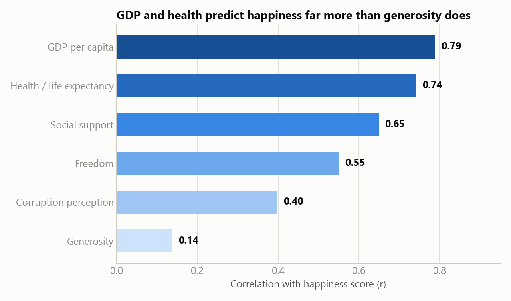

# World Happiness Report Case Study

Capstone Case Study 3 ("Follow Your Own Case Study Path") from the Google Data Analytics
Professional Certificate. Client scenario: a development NGO wants to know **which factors are
most strongly associated with national happiness, and does that hold across regions?**

## Process

1. [Ask](./docs/01_ask.md) — business task & stakeholders ✅
2. [Prepare](./docs/02_prepare.md) — data sources, organization, credibility ✅
3. [Process](./docs/03_process.md) — cleaning & transformation ✅
4. [Analyze](./docs/04_analyze.md) — trends & calculations ✅
5. [Share](./docs/05_share.md) — visualizations & key findings ✅
6. [Act](./docs/06_act.md) — final recommendations ✅

## Top recommendation

Prioritize **economic-security and healthcare-access programs** over generosity- or
civic-engagement-framed initiatives — GDP per capita and health/life expectancy are the strongest,
most consistent correlates of happiness in this data. Full reasoning and 2 more recommendations in
[docs/06_act.md](./docs/06_act.md).

## Key finding



GDP per capita and health/life expectancy predict happiness far more than generosity does — see
[docs/05_share.md](./docs/05_share.md) for the full set of visualizations.

## Repo structure

```
world-happiness-case-study/
├── docs/         # write-ups for each phase (Ask, Prepare, Process, Analyze, Share, Act)
├── data/
│   ├── raw/      # original downloaded data (not committed — see data/raw/README.md)
│   ├── processed/# cleaned/merged datasets used for analysis
│   └── summary/  # small aggregate tables used to build the Share-phase charts
├── notebooks/    # Python (pandas/Jupyter) analysis
├── sql/          # SQL scripts
└── images/       # exported charts/visualizations
```

## Data source

[World Happiness Report](https://www.kaggle.com/unsdsn/world-happiness) (Kaggle, CC0, via the
Sustainable Development Solutions Network).
