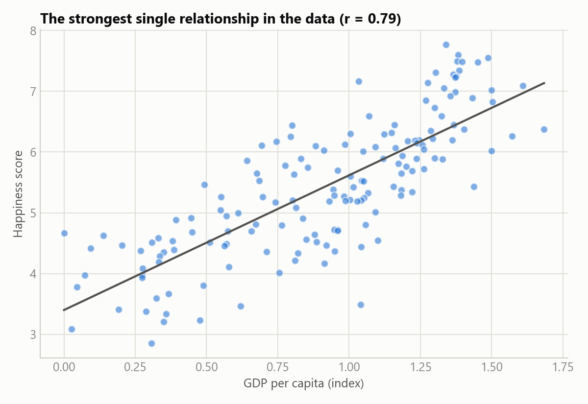
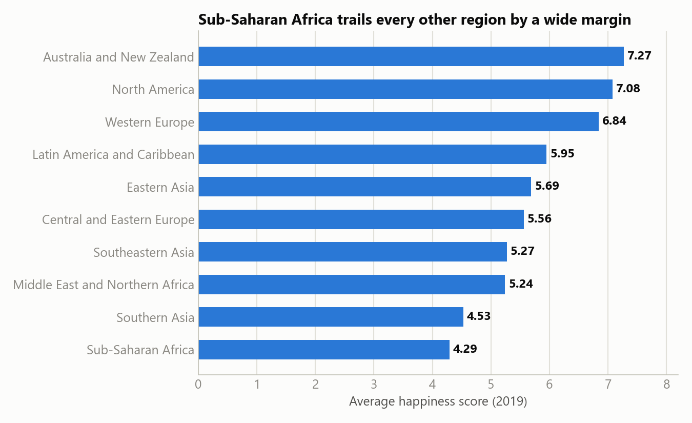
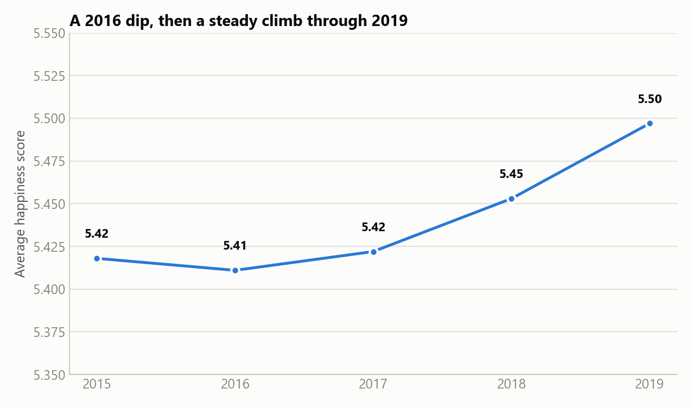
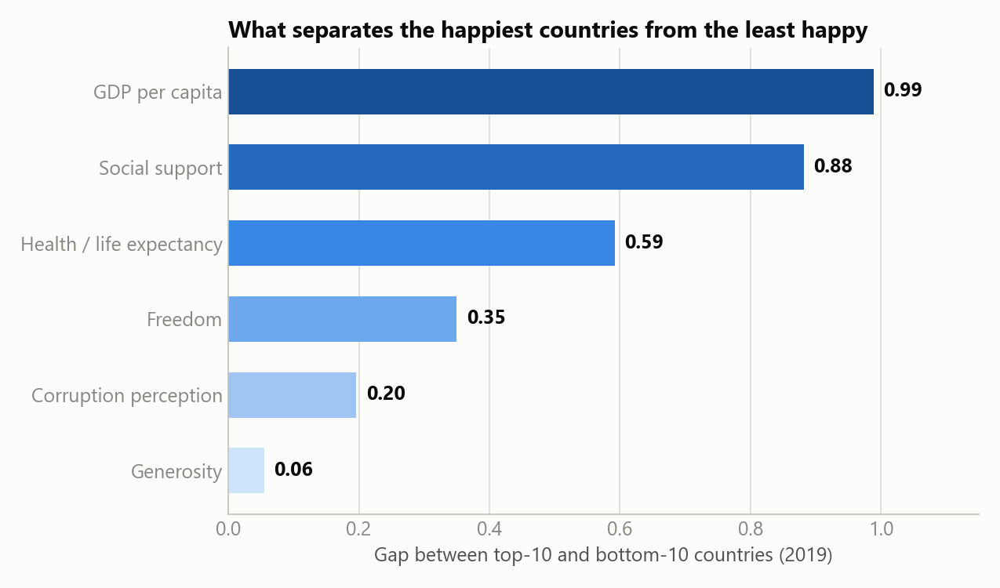

# 5. Share

Five visualizations for the client-facing deliverable: a single blue hue for the categorical/trend
charts, light→dark sequential ramp for the two ranked/ordinal charts (correlation strength,
factor gap), direct value labels, minimal clutter.

Chart-generation code: [`notebooks/03_share_visualizations.ipynb`](../notebooks/03_share_visualizations.ipynb).

## 1. What predicts happiness

GDP per capita (r=0.79) and health/life expectancy (r=0.74) dominate. Generosity (r=0.14) barely
moves the needle, despite being one of the report's 6 headline factors.

## 2. The strongest relationship, in detail

Every country plotted by GDP per capita vs. happiness score (2019) — a clear, strong upward
relationship, with meaningful scatter (economics isn't everything, but it's the biggest single
factor).

## 3. Where happiness is highest and lowest

A ~3-point gap on the 0–10 scale separates the top region (Australia/NZ, 7.27) from the bottom
(Sub-Saharan Africa, 4.29).

## 4. How happiness has moved over time

A slight dip in 2016, then a steady climb through 2019 — net positive across the 5-year window,
not a smooth line.

## 5. What actually separates the happiest from the least happy

The same ranking as chart 1, from an independent angle: GDP and social support show the largest
gaps between the world's happiest and least-happy countries; generosity shows almost none.

## What the data tells

Every chart converges on the same conclusion: **economic security and social support are the
strongest, most consistent correlates of national happiness in this data — not generosity, and
not even freedom**, despite both being part of the report's official framing. That's a specific,
somewhat counter-intuitive finding that directly shapes the Act-phase recommendations for a
development-focused client.
